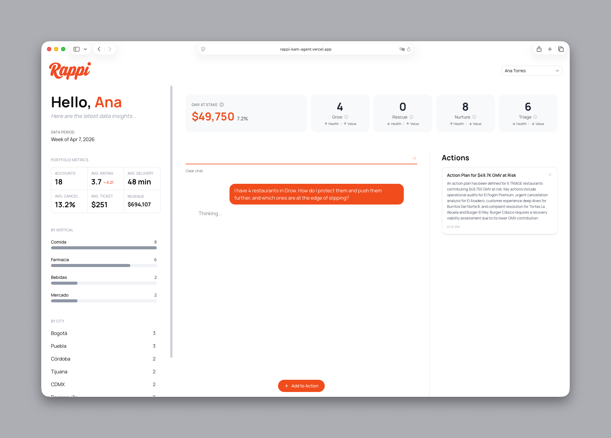

# Proactive Risk Detection Agent for Rappi KAMs

> **Rappi AI Builder Challenge — Case 02: Agente de Inteligencia Operativa**
>
> A multi-agent system that turns a KAM's 450-restaurant portfolio from a reactive spreadsheet into a prioritized Monday-morning briefing: what's breaking, what's growing, and exactly what to do about it — in one chat.



## Live demo

| | URL |
|---|---|
| **Dashboard** (try the chat) | https://rappi-kam-agent.vercel.app/dashboard |
| **Backend API** (FastAPI + OpenAPI docs at `/docs`) | https://backend-production-537d.up.railway.app |
| **Observability** (LangFuse traces — every agent call, tool call, and token) | https://us.cloud.langfuse.com/project/cmnpd1ac105hnad07g5d4kfe5 |

Pick any KAM from the header dropdown and ask: *"dame el briefing de esta semana"*, *"qué estrategia recomendarías para Sushi Fusión 8?"*, *"loggea $200 en promo para El Parrillero"*. Every response is streamed from a live agent call, traced end-to-end in LangFuse.

---

## How it maps to the evaluation criteria

The challenge is scored on five dimensions (20 pts each). This map points to where each answer lives so you don't have to hunt for it.

| Criterion | Where to look | TL;DR |
|---|---|---|
| **1 · Lógica de detección de riesgo** | [`docs/01-business-case.md § Risk detection logic`](./docs/01-business-case.md#risk-detection-logic) | 6 signals chosen via hierarchical clustering on the correlation distance matrix (drops redundant pairs like `rating_actual`/`rating_prom_30d` at r=0.98). Weights set by business reasoning, not statistics — `delta_rating` (0.25) leads because it's the earliest warning. Validated against the reference semáforo: clean separation at 86.9 / 61.7 / 30.0 avg Health. |
| **2 · Calidad del output** | [Demo chat](https://rappi-kam-agent.vercel.app/dashboard) · [`docs/01-business-case.md § What changes for the KAM`](./docs/01-business-case.md#what-changes-for-the-kam) | Alerts carry five things the KAM needs to act: quadrant, dominant risk signal, revenue at stake, time-horizon override, and a concrete RGM recommendation. No "investigate operations" — instead "review kitchen staffing at peak hours, delivery time creep precedes cancellation spikes." |
| **3 · Arquitectura del agente** | [`docs/02-technical-implementation.md`](./docs/02-technical-implementation.md) · [`docs/03-agent-runtime.md`](./docs/03-agent-runtime.md) · [`backend/app/agents/`](./backend/app/agents/) | Router → 3 specialists (Diagnostic / RGM Strategy / Budget). Deterministic scoring in pandas (fast, auditable, reproducible) — LLMs only reason about *strategy* and *communication*. Provider-agnostic adapter layer (Gemini / OpenAI / Anthropic, swappable via env var, even per agent). |
| **4 · Criterio de negocio** | [`docs/01-business-case.md § The ecosystem context`](./docs/01-business-case.md#the-ecosystem-context) | Two-axis classification (Health × Value) instead of a one-dimensional traffic light — because a green light on a $4K/week restaurant and a green light on a $220K/week restaurant should trigger very different KAM behavior. Velocity override escalates GROW accounts *before* they become RESCUE cases, breaking the failure chain at step 2. |
| **5 · Documentación y presentación** | This README + [`docs/`](./docs/) + live demo | Business case, technical architecture, and runtime walkthrough are split into three docs so each can be read in isolation. LangFuse gives a live call-graph during the presentation. |

---

## The product in 30 seconds

A KAM opens the dashboard, picks their name from the dropdown, and sees:

1. **Quadrant scatter** — every restaurant placed on a Health × Revenue matrix, colored by quadrant
2. **Alert feed** — prioritized list: RESCUE first, then velocity-escalated GROW, then TRIAGE, then GROW opportunities
3. **Budget tracker** — remaining weekly discretionary spend ($10K MXN/week, Ritz Carlton-style KAM autonomy)
4. **Chat panel** — ask anything; the router picks the right specialist agent

The KAM's 30 weekly touchpoints become *the right 30*: informed by data, prioritized by risk *and* opportunity, and paired with specific strategies. The shift is from firefighter to portfolio strategist.

---

## Risk detection logic at a glance

**6 signals**, combined into a 0–100 Health Score via min-max normalization + weighted sum:

| Weight | Signal | Why |
|---|---|---|
| 0.25 | `delta_rating` | Earliest warning — rating velocity tells you where a restaurant is headed before it arrives |
| 0.20 | `tasa_cancelacion_pct` | Most directly actionable — tablet uptime, stock-outs, prep capacity are all concrete levers |
| 0.20 | `quejas_7d` | Real-time signal; critical restaurants average 28/week vs. 3 for stable (9× gap) |
| 0.15 | `rating_actual` | Current consumer perception; weighted lower to avoid double-counting with `delta_rating` |
| 0.10 | `tiempo_entrega_avg_min` | Silent killer — consumers leave before complaining |
| 0.10 | `var_ordenes_pct` | Demand trajectory; lagging — by the time volume drops, damage is underway |

**Two-axis classification** (Health × Value) with Pareto revenue split (~$71.8K/week threshold):

| | High Health | Low Health |
|---|---|---|
| **High Value** | 🟢 **GROW** — revenue engine; sell ads, menu optimization, expansion | 🔴 **RESCUE** — high revenue at stake, deteriorating fast; act today |
| **Low Value** | 🔵 **NURTURE** — stable but small; light touch, scale into high value | 🟡 **TRIAGE** — evaluate recovery viability vs. natural churn |

**Velocity override** escalates the time horizon regardless of current quadrant: `delta_rating < −0.4` OR `var_ordenes_pct < −20%` → 5-day action window; both firing → immediate. This is what catches a GROW account *before* it becomes a RESCUE case — the whole point of "proactive."

The full derivation (clustering analysis, normalization ranges, validation against the reference semáforo) lives in [`docs/01-business-case.md`](./docs/01-business-case.md).

---

## Architecture at a glance

```
┌───────────────────────────────────────────────────────────┐
│               Next.js 16 Dashboard (Vercel)               │
│    KAM selector · Quadrant scatter · Alerts · Chat        │
└───────────────────────────┬───────────────────────────────┘
                            │  REST + SSE streaming
┌───────────────────────────▼───────────────────────────────┐
│               FastAPI Backend (Railway)                    │
│                                                            │
│   LLM Provider Abstraction — Gemini · OpenAI · Anthropic   │
│   (swap via env var, per-agent overrides supported)        │
│                                                            │
│   ┌───────────────── Router Agent ─────────────────┐       │
│   │   Classifies KAM intent, delegates to:         │       │
│   │   ┌───────────┐  ┌─────────────┐  ┌─────────┐  │       │
│   │   │Diagnostic │  │ RGM Strategy │  │ Budget  │  │       │
│   │   └─────┬─────┘  └──────┬──────┘  └────┬────┘  │       │
│   └─────────┼───────────────┼───────────────┼──────┘       │
│             ▼               ▼               ▼              │
│   ┌──────────────────────────────────────────────────┐     │
│   │     Diagnostic Engine  (pandas · deterministic)  │     │
│   │     Scoring · Quadrants · Velocity · Budget log  │     │
│   └──────────────────────────────────────────────────┘     │
│                                                            │
│             LangFuse — full trace tree per request         │
└────────────────────────────────────────────────────────────┘
```

**Key design decision: deterministic scoring, LLM for strategy only.** Health scores, quadrants, and velocity flags are computed by pandas — pure math, reproducible, auditable. The agents consume structured results via function-calling tools and generate natural-language briefings, recommendations, and follow-up answers. No LLM ever recomputes a metric.

**Why three specialist agents instead of one:** (1) prompt bloat — each agent's context stays focused, (2) independent iteration — changing the RGM playbooks doesn't risk breaking diagnostic briefings, (3) targeted evaluation — each agent has its own golden dataset scored on its own rubric.

Deep dive: [`docs/02-technical-implementation.md`](./docs/02-technical-implementation.md) (architecture + eval framework) and [`docs/03-agent-runtime.md`](./docs/03-agent-runtime.md) (code walkthrough).

---

## Repo map

```
.
├── README.md                       ← you are here
├── CLAUDE.md                       Project conventions (for AI assistants)
├── docker-compose.yml              One-shot local dev (backend + frontend)
│
├── docs/
│   ├── 01-business-case.md         Ecosystem analysis, scoring derivation, quadrant logic
│   ├── 02-technical-implementation.md  Architecture, provider layer, agent design, eval framework
│   ├── 03-agent-runtime.md         Code-level runtime walkthrough, tracing, debugging recipes
│   └── challenge.pdf               Original Rappi AI Builder Challenge brief
│
├── data-exploration/
│   ├── dataset.csv                 205 restaurants (200 base + 5 synthetic RESCUE cases — documented)
│   ├── exploration.ipynb           Hierarchical clustering, signal selection, validation plots
│   └── plots/                      Rendered figures used in docs/01-business-case.md
│
├── backend/                        Python 3.12 · FastAPI · pandas
│   ├── app/
│   │   ├── main.py                 Lifespan bootstrap: loads engine + budget manager into app.state
│   │   ├── config.py               Pydantic settings (env vars → typed config)
│   │   ├── api/                    REST routes: /api/chat (SSE), /api/dashboard, /api/budget
│   │   ├── agents/                 Router + Diagnostic + RGM Strategy + Budget + prompts/
│   │   ├── engine/                 Deterministic scoring, classification, velocity, queries
│   │   ├── llm/                    Provider protocol + Gemini/OpenAI/Anthropic adapters
│   │   ├── budget/                 KAM discretionary budget manager (CSV-backed)
│   │   └── observability/          LangFuse singleton
│   ├── data/                       dataset.csv (Docker-mounted from data-exploration/)
│   ├── tests/                      pytest suite (engine unit tests)
│   ├── Dockerfile                  Backend image
│   ├── railway.toml                Railway deployment config
│   └── requirements.txt
│
├── frontend/                       Next.js 16 · React 19 · Tailwind · shadcn/ui
│   ├── src/app/                    App Router pages (/dashboard)
│   ├── src/components/             UI — quadrant scatter, alert feed, chat panel
│   ├── src/hooks/                  useChat (SSE streaming), useDashboardData
│   ├── src/lib/                    API client
│   └── vercel.json
│
└── evals/                          LLM evaluation framework
    ├── run_evals.py                Entry point — `python evals/run_evals.py --dimension diagnostic`
    ├── datasets/                   Golden datasets per dimension
    └── scorers/                    Rule-based + LLM-as-judge scorers
```

---

## Run it locally

### Prerequisites

- Docker (recommended path), or Python 3.12+ and Node 20+
- One LLM API key: `GOOGLE_API_KEY` (default), `OPENAI_API_KEY`, or `ANTHROPIC_API_KEY`
- LangFuse keys are **optional** — tracing no-ops silently if unset

### One-command Docker

```bash
cp .env.example .env                # fill in GOOGLE_API_KEY
docker compose up --build
```

- Backend: http://localhost:8000 (OpenAPI at `/docs`)
- Frontend: http://localhost:3000

### Without Docker

```bash
# Backend
python3.12 -m venv .venv && source .venv/bin/activate
pip install -r backend/requirements.txt
cp data-exploration/dataset.csv backend/data/dataset.csv   # one-time
cd backend && uvicorn app.main:app --reload                # :8000

# Frontend (separate shell)
cd frontend && npm install && npm run dev                  # :3000
```

### Swap LLM providers

```bash
# Set the defaults...
LLM_PROVIDER=openai
LLM_MODEL=gpt-4o

# ...or override per agent
RGM_AGENT_PROVIDER=anthropic
RGM_AGENT_MODEL=claude-opus-4-6
```

The agent loop, prompts, and tool schemas don't change — the provider adapter layer handles translation.

---

## Tests and evaluation

```bash
cd backend && source ../.venv/bin/activate
pytest tests/ -v                              # unit tests (engine + scoring)
python ../evals/run_evals.py --dimension diagnostic    # LLM evals (requires API key)
python ../evals/run_evals.py --all                     # all four dimensions
```

The eval framework scores four dimensions with golden datasets and LangFuse-logged runs: **diagnostic accuracy** (quadrant/score citation), **recommendation quality** (quadrant-strategy alignment, actionability, hallucination detection), **budget correctness** (pure arithmetic), and **communication quality** (structure, tone, conciseness). Full rubric in [`docs/02-technical-implementation.md § Evaluation framework`](./docs/02-technical-implementation.md#evaluation-framework).

---

## Decisions and trade-offs

> *The challenge brief asks for a page on "what I'd do differently with more time." This is it.*

**Kept simple on purpose:**
- **In-memory DataFrame instead of a database.** 205 restaurants fit in RAM and recompute in <100ms. A Postgres table would add operational overhead with zero correctness benefit at this scale.
- **CSV-backed intervention log.** Budget state persists to `interventions.csv` on append. Ephemeral in Railway (acceptable for the demo), trivially swappable for Postgres in production.
- **No authentication.** The KAM selector dropdown is a demo convenience, not a security mechanism. Production would add SSO (Okta/Google) and per-KAM row-level scoping in the backend.
- **Synthetic RESCUE cases.** The original 200-restaurant dataset had *zero* RESCUE quadrant entries — all high-revenue restaurants were healthy (which is real, and makes sense: healthy ops drive volume). To demo the RESCUE flow, I added 5 clearly-documented synthetic cases covering different failure modes (freefall, premium account losing control, GROW-to-RESCUE transition, borderline, extreme collapse). See [`docs/01-business-case.md § Two-axis classification`](./docs/01-business-case.md#two-axis-classification-health--value).

**What I'd do with more time:**
- **Close the feedback loop on intervention ROI.** Every logged intervention captures `health_score_before`; `health_score_after` is populated 7 days later. With a few weeks of data this becomes a per-quadrant ROI table that teaches the RGM agent which strategies actually work — moving from "advice" to "validated playbooks."
- **Parallelize multi-agent calls.** Today the router calls Diagnostic and RGM sequentially when an intent spans both. For a detailed "tell me about X and give me a strategy" query, these could run in parallel for ~40% latency reduction.
- **Switch from SSE to token-level streaming during tool loops.** Currently the user sees "Thinking…" until the tool loop finishes. Streaming partial reasoning ("*calling get_kam_briefing…*") would make the experience feel snappier even though total latency is identical.
- **Multi-turn eval scenarios.** Current golden datasets are single-turn. Real KAM conversations chain ("tell me more about Burger Clásico" → "what's your recommendation?" → "log $150 on that"). Multi-turn evals would catch context-propagation regressions.
- **Cost/latency-aware provider routing.** The provider abstraction already supports per-agent overrides. A richer policy — "use Flash for Diagnostic, GPT-4o for RGM only when the restaurant is in RESCUE" — would optimize the cost/quality trade-off per query.

---

## Tech stack

| Layer | Choice | Rationale |
|---|---|---|
| Frontend | **Next.js 16** (App Router) · React 19 · Tailwind · shadcn/ui | Modern React with SSR, streaming, deployed on Vercel with zero-config previews |
| Backend | **Python 3.12 FastAPI** | Async-native, high-performance; hosts agents, provider layer, engine in one process |
| LLM (default) | **Gemini 2.5 Flash** via `google-genai` | ~1s inference, 1M context, native function calling |
| LLM (alternates) | **OpenAI · Anthropic** | Same adapter interface, swap via env var |
| Scoring | **pandas · numpy** | Deterministic — no LLM touches metric computation |
| Observability | **LangFuse** | Every request traced: router → sub-agents → tools → LLM calls, with token/cost/latency |
| Deployment | **Vercel** (frontend) + **Railway** (backend) | Zero-config previews; Railway honors `$PORT` for the FastAPI container |

---

## Further reading

- [`docs/01-business-case.md`](./docs/01-business-case.md) — the business case: ecosystem analysis, signal selection via clustering, scoring derivation, quadrant validation, impact projection
- [`docs/02-technical-implementation.md`](./docs/02-technical-implementation.md) — technical architecture: provider abstraction, multi-agent design, eval framework, observability
- [`docs/03-agent-runtime.md`](./docs/03-agent-runtime.md) — runtime walkthrough: the tool loop, request lifecycle, tracing hierarchy, debugging recipes
- [`docs/challenge.pdf`](./docs/challenge.pdf) — the original challenge brief

---

*Built for the Rappi AI Builder Challenge — Case 02. 2026.*
