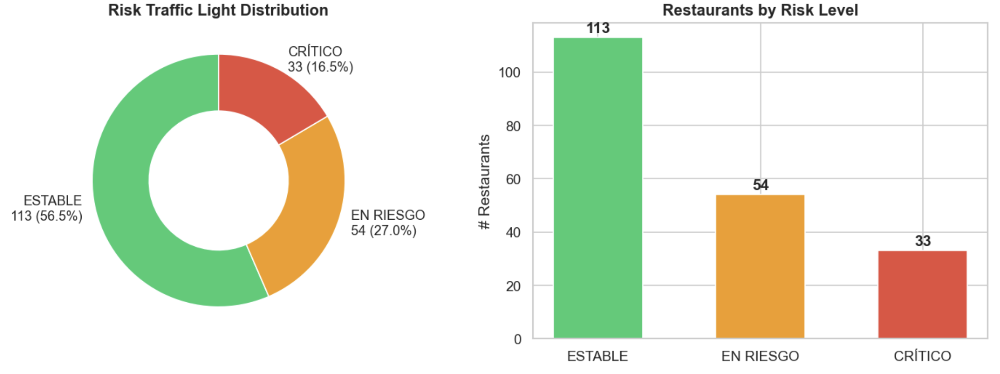
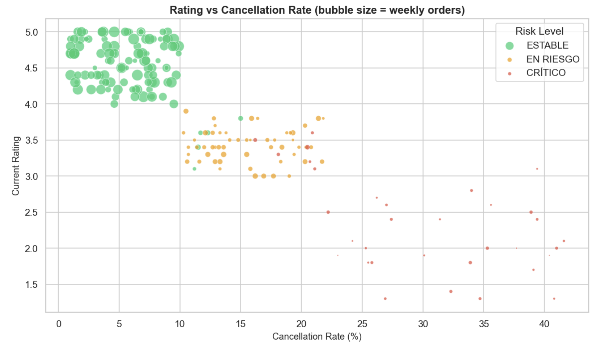
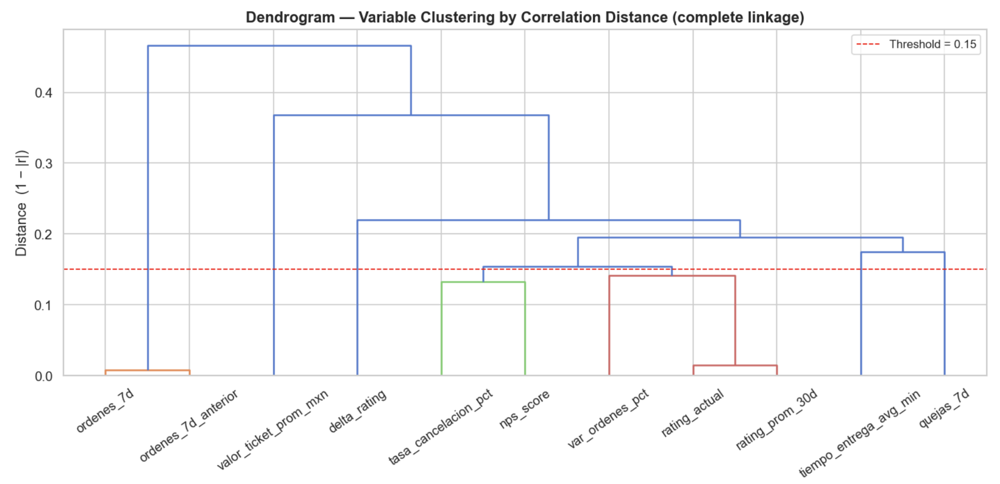

# Business case: Proactive risk detection agent for Rappi KAMs

## Executive summary

Rappi's KAMs manage portfolios of 300–600 restaurants each. Today, monitoring is entirely reactive — problems are discovered after they've already damaged ratings, sales, and consumer retention.

This document proposes a proactive risk detection agent that processes early warning signals from restaurant performance data, classifies severity, and delivers actionable notifications to each KAM — transforming their workflow from firefighting to strategic account management.

---

## The ecosystem context

Food delivery platforms operate in a multi-sided marketplace where every actor's behavior is shaped by competing incentives and emotional realities. The KAM sits at the center of these tensions, and understanding them is critical to designing an effective intervention system.

### The actors and their emotional reality

**KAM — Pressured, stretched thin.**
A KAM juggling 450 restaurants can meaningfully engage with ~30 per week. That means 93% of their portfolio is unmonitored at any given time. Their targets span revenue growth, ad sales, and support escalation — all pulling in different directions. They don't need more dashboards. They need someone (or something) telling them exactly where to look and what to do.

**Restaurant — Dependent but resentful.**
Restaurants need Rappi for order volume and visibility, but they resent the commission structure, the lack of direct customer data, and the feeling that they're commoditized. When a restaurant feels unsupported — a spike in cancellations goes unaddressed, a menu optimization suggestion never comes — they don't leave Rappi entirely. They simply start giving priority prep and attention to whichever platform's KAM showed up last with a better offer. This is silent churn, and it's the hardest to detect.

**Competitors — Aggressive, opportunistic.**
Uber Eats and Didi Food are watching for every gap in Rappi's service. A restaurant whose KAM hasn't called in three weeks is a restaurant ripe for a competitor's lower-commission pitch. The competitive battle isn't won at the contract level — it's won in the weekly share of the restaurant's attention and volume.

**Consumers — Impatient, disloyal.**
Loyalty is thin and entirely incentive-driven. Consumers will switch platforms for a $1 promo or 5 minutes of faster delivery. When a restaurant's operational quality degrades on Rappi — slow prep times, high cancellation rates, stale menus — consumers don't complain to the restaurant. They simply stop ordering from Rappi and switch to the same restaurant on a competitor's app, or switch restaurants entirely. The consumer's silent exit is what makes restaurant health monitoring so urgent: by the time the rating drops, the consumer is already gone.

### The emotional chain reaction

These emotions create a compounding failure loop when a restaurant starts to struggle:

1. Restaurant experiences an operational issue (kitchen overload, staff turnover, stock-outs)
2. Cancellations rise, delivery times spike, complaints increase
3. Consumers — impatient and disloyal — stop ordering from that restaurant on Rappi
4. Order volume drops, but the KAM doesn't notice (they're managing 420 other accounts)
5. The restaurant, feeling unsupported and resentful, accepts a competitor's outreach
6. By the time the KAM sees the volume drop in month-end reporting, the restaurant has already shifted its primary platform allegiance
7. Recovery now requires heavy incentives (commission renegotiation, promo spend) — if it's possible at all

The agent's purpose is to **break this chain at step 2** — detecting the operational signals before they cascade into volume loss and competitor capture.

### Current portfolio snapshot

This isn't hypothetical. A snapshot of 200 restaurant partners shows that **43.5% of the portfolio is already at risk or critical** — and without a proactive system, these restaurants sit in KAM blind spots until the damage is irreversible.



The scatter below maps every restaurant by cancellation rate vs. rating, with bubble size representing weekly order volume. The pattern is clear: as cancellations climb, ratings collapse and order volume shrinks — the compounding failure loop described above, already playing out across the portfolio. The orange "at-risk" cluster is where early intervention has the highest leverage; without detection, these restaurants drift silently into critical territory.



---

## Risk detection logic

### Signal selection via hierarchical clustering

The dataset contains 11 numeric variables. Many are highly correlated (e.g., `rating_actual` and `rating_prom_30d` at r = 0.98, `ordenes_7d` and `ordenes_7d_anterior` at r = 0.99). Building a risk score on raw variables would double-count the same underlying signals and make weights uninterpretable.

To identify which variables measure the same thing and which capture distinct risk dimensions, we ran hierarchical clustering on the correlation distance matrix (1 − |r|) using complete linkage. The resulting dendrogram was cut at threshold = 0.15, producing 7 clusters:



| Cluster | Variables | Interpretation |
|---------|-----------|----------------|
| 1 | ordenes_7d, ordenes_7d_anterior | Absolute volume (redundant pair) |
| 2 | tasa_cancelacion_pct, nps_score | Experience reliability |
| 3 | rating_actual, rating_prom_30d, var_ordenes_pct | Current health composite |
| 4 | tiempo_entrega_avg_min | Delivery performance |
| 5 | quejas_7d | Complaint intensity |
| 6 | delta_rating | Rating trajectory |
| 7 | valor_ticket_prom_mxn | Ticket economics |

### From clusters to scoring signals

For each cluster we picked the variable a KAM can most directly act on, dropping redundant or less actionable alternatives:

| Cluster | Selected signal | Why this one | What was dropped and why |
|---------|----------------|--------------|--------------------------|
| 1 | — | Absolute volume doesn't indicate risk; a restaurant doing 50 orders/week isn't inherently unhealthy — it may be small. The *change* in volume (var_ordenes_pct, Cluster 3) is the actual risk signal. | ordenes_7d, ordenes_7d_anterior → used only in the revenue-at-risk multiplier |
| 2 | tasa_cancelacion_pct | Directly actionable: a KAM can investigate cancellation causes (stock-outs, tablet downtime, prep delays). | nps_score → lagging composite that reflects the same reality but gives no specific lever to pull |
| 3 | rating_actual + var_ordenes_pct | These answer different business questions: "how is the restaurant perceived now?" vs. "is demand growing or shrinking?" Despite r = 0.87, both are kept because they drive different KAM actions. | rating_prom_30d → redundant with rating_actual + delta_rating |
| 4 | tiempo_entrega_avg_min | Standalone operational signal. A restaurant with decent ratings but 60+ min delivery is a ticking time bomb — consumers leave silently before ratings reflect it. | — |
| 5 | quejas_7d | Most immediate, real-time trouble signal. Critical restaurants average 28 complaints/week vs. 3 for stable. Complaints deteriorate before ratings do. | — |
| 6 | delta_rating | The *velocity* of rating change — the most important early warning signal. A restaurant at 4.0 dropping 0.3/week is more urgent than one sitting at 3.5 but stable. | — |
| 7 | — | Ticket value doesn't indicate risk; high or low ticket is a business model characteristic, not a health signal. | valor_ticket_prom_mxn → used only in the revenue-at-risk multiplier |

### Final scoring architecture

**6 risk signals** (combined into a composite risk score):

1. `rating_actual` — current experience quality
2. `delta_rating` — rating trajectory / velocity of change
3. `tasa_cancelacion_pct` — operational reliability
4. `tiempo_entrega_avg_min` — delivery performance
5. `quejas_7d` — real-time complaint intensity
6. `var_ordenes_pct` — demand trajectory

**1 prioritization multiplier** (applied after scoring to rank alerts):

- `weekly_revenue_at_risk` = ordenes_7d × valor_ticket_prom_mxn

The risk score answers **"how sick is this restaurant?"** The revenue multiplier answers **"how much money is at stake if we don't act?"** Keeping them separate prevents high-revenue restaurants from masking operational problems, and ensures small but critically ill restaurants aren't buried in the alert queue. The KAM receives both: a severity classification and a revenue impact estimate.

### Why not just use the existing semáforo?

The dataset includes a `semaforo_riesgo` field (🔴 CRÍTICO / 🟡 EN RIESGO / 🟢 ESTABLE). It's a useful starting reference, but it has two fundamental limitations that make it insufficient as the foundation of a KAM operating system:

**1. It has no concept of opportunity.** A healthy restaurant generating $220K/week with rising NPS and growing volume gets the same green light as a stable restaurant doing $4K/week. The semáforo tells the KAM "nothing is wrong here" — so the KAM ignores both. Meanwhile, a competitor KAM visits the $220K restaurant with a lower commission offer and captures share. The semáforo protects against downside but is completely blind to upside.

**2. It has no action layer.** Red means "bad" but doesn't tell the KAM whether the problem is delivery ops, menu quality, consumer perception, or demand erosion. The KAM still has to open four dashboards and investigate manually — which, at 450 accounts, means most red flags never get investigated at all.

Our system replaces the one-dimensional triage with a two-axis classification that answers both "what's wrong?" and "what should I do?" — and critically, it also answers "where should I invest to grow?"

### Composite Health Score

Each signal is normalized to a 0–100 scale using min-max normalization against the observed data range. Signals where higher is worse (cancellations, delivery time, complaints) scale directly to 0–100. Signals where higher is better (rating, order growth) are inverted (100 − normalized value). This produces a **risk score** where 0 = perfectly healthy and 100 = maximum distress. The **Health Score** is simply `100 − risk_score`, so 100 = healthiest.

**Normalization ranges (from dataset):**

| Signal | Min | Max | Direction |
|--------|-----|-----|-----------|
| rating_actual | 1.3 | 5.0 | Inverted (higher = healthier) |
| delta_rating | −0.89 | 0.30 | Inverted (positive delta = improving) |
| tasa_cancelacion_pct | 1.0% | 41.6% | Direct (higher = worse) |
| tiempo_entrega_avg_min | 18 min | 95 min | Direct (higher = worse) |
| quejas_7d | 0 | 45 | Direct (higher = worse) |
| var_ordenes_pct | −42.9% | +19.9% | Inverted (growth = healthier) |

**Weights (business-driven):**

| Signal | Weight | Rationale |
|--------|--------|-----------|
| delta_rating | 0.25 | Highest weight — the earliest warning signal. A restaurant's rating velocity tells you where it's headed before it arrives. This is where the agent breaks the failure chain at step 2. |
| tasa_cancelacion_pct | 0.20 | Cancellations are the most directly actionable signal for a KAM. They can investigate tablet uptime, stock-outs, prep capacity — concrete levers. |
| quejas_7d | 0.20 | Real-time signal. Complaints spike before ratings drop. Critical restaurants average 28/week vs. 3 for stable — a 9x gap that's detectable within days. |
| rating_actual | 0.15 | Current consumer perception. Important but partially redundant with delta_rating (which captures the trend). Weighted lower to avoid double-counting. |
| tiempo_entrega_avg_min | 0.10 | Operational capacity signal. Delivery time > 50 min is a silent killer — consumers leave before complaining. Lower weight because it's partially captured by cancellation rate. |
| var_ordenes_pct | 0.10 | Demand trajectory. Volume decline confirms that consumer behavior has already shifted. Lower weight because it's a lagging indicator — by the time volume drops, the damage is underway. |

**Formula:**

```
risk_score = 0.25 × norm(delta_rating)
           + 0.20 × norm(tasa_cancelacion_pct)
           + 0.20 × norm(quejas_7d)
           + 0.15 × norm(rating_actual)
           + 0.10 × norm(tiempo_entrega_avg_min)
           + 0.10 × norm(var_ordenes_pct)

health_score = 100 − risk_score
```

**Validation against reference semáforo:**

| Reference label | Avg Health Score | Std | Range |
|----------------|-----------------|-----|-------|
| 🟢 ESTABLE | 86.9 | 5.7 | 64.0 – 96.6 |
| 🟡 EN RIESGO | 61.7 | 3.0 | 55.7 – 66.9 |
| 🔴 CRÍTICO | 30.0 | 15.0 | 10.3 – 64.4 |

The composite score produces clean separation between the three reference groups, confirming the signal selection and weighting are sound. The wider spread in CRÍTICO (std = 15.0) reflects that critical restaurants fail in different ways — some have catastrophic ratings, others have extreme complaint volumes, others have delivery collapses. The composite captures all of these failure modes.

### Two-axis classification: Health × Value

Instead of a single severity scale, every restaurant is classified on two independent axes:

**Health axis** — the composite Health Score (0–100), split at a configurable threshold.

**Value axis** — weekly revenue (`ordenes_7d × valor_ticket_prom_mxn`), split at the Pareto threshold: the revenue level above which restaurants account for ~80% of total portfolio GMV. In the current dataset, this threshold is approximately $71,800/week, with 78 restaurants (39%) generating 79.6% of total revenue.

This produces four strategic quadrants:

| | High Health | Low Health |
|---|---|---|
| **High Value** | **GROW** — Protect and expand. These are the portfolio's revenue engine. The KAM's job here isn't firefighting — it's revenue growth through ads, menu optimization, promos, and expansion. | **RESCUE** — Stop the bleeding. High revenue at stake, deteriorating health. Act today. |
| **Low Value** | **NURTURE** — Stable but small. Light touch, help them scale into high-value territory. | **TRIAGE** — Low revenue, low health. Evaluate: is recovery worth the investment, or should natural churn take its course? |

**What the data reveals:** The original 200-restaurant dataset had zero RESCUE cases — all high-value restaurants were healthy (min Health Score = 77.9). This makes business sense: restaurants with high order volume tend to have strong operations *because* healthy ops drive volume. It also validates the model: the correlation between revenue and health is real, and the Pareto split cleanly separates the portfolio.

However, RESCUE is not a theoretical quadrant — it's the one the system exists to *catch*. High-value restaurants can and do deteriorate: a key chef leaves, a supply chain issue hits, a competitor launches an aggressive promo in the zone. To stress-test the system and demonstrate RESCUE detection, we added 5 synthetic restaurants representing realistic scenarios where high-revenue accounts are in distress:

| Restaurant | City | Revenue/week | Health Score | Scenario |
|-----------|------|-------------|--------------|----------|
| El Parrillero de Polanco | CDMX | $107,940 | 24.3 | Established high-volume restaurant in freefall — rating crashed, complaints exploding, delivery times doubled |
| Sushi Premium Chapultepec | CDMX | $140,368 | 35.3 | Premium account losing control — cancellations at 24%, rating dropped from 4.1 to 2.8 in 30 days |
| Carnitas Don Pedro Reforma | Monterrey | $76,011 | 47.3 | Mid-transition — was a GROW account, velocity signals crashing but absolute health not yet catastrophic. The most interesting case: the system catches this *before* it becomes a full RESCUE emergency |
| La Fonda de Santa Fe | Bogotá | $76,054 | 55.3 | Borderline — health right at the threshold, could go either way. Tests the system's handling of ambiguity |
| Burger House El Rosario | Lima | $82,076 | 9.9 | Extreme collapse — was a top performer, now in total freefall across every signal. Tests floor detection |

These synthetic cases are clearly documented and serve two purposes: (1) they populate all four quadrants for a complete demo, and (2) they let us verify the system responds correctly to the highest-stakes scenario — a revenue-critical restaurant that's dying.

**Current portfolio distribution (205 restaurants):**

| Quadrant | Restaurants | Weekly Revenue | % of Total Revenue |
|----------|-------------|----------------|--------------------|
| GROW | 78 | $9,381,788 | 76.3% |
| RESCUE | 5 | $482,449 | 3.9% |
| NURTURE | 95 | $2,301,583 | 18.7% |
| TRIAGE | 27 | $104,327 | 0.8% |

### Velocity override: the early warning escalation

The quadrant classification captures the current state. But the most valuable intervention happens when a restaurant is *transitioning* — not yet critical, but deteriorating fast. The velocity override escalates the KAM's time horizon regardless of the current quadrant:

- `delta_rating < −0.4` → rating is crashing (21 restaurants in current dataset)
- `var_ordenes_pct < −20%` → demand is collapsing (26 restaurants)
- Both signals firing simultaneously → compound deterioration (20 restaurants)

**Escalation rules:**

| Condition | Time horizon override |
|-----------|----------------------|
| Either velocity signal fires | Escalate to 5-day action window (from default 2-week) |
| Both velocity signals fire | Escalate to today (immediate KAM action regardless of quadrant) |

This is particularly important for GROW restaurants: a high-value, currently-healthy restaurant that starts showing velocity deterioration gets flagged *before* it becomes a RESCUE case. The KAM intervenes while the restaurant still has momentum, when a single call or operational adjustment can reverse the trend — instead of after the damage is done and recovery requires heavy incentives.

### KAM autonomy: the Ritz Carlton model

Inspired by the Ritz Carlton's employee empowerment model, each KAM receives a fixed weekly discretionary budget to invest across their portfolio without requiring supervisor approval. This recognizes that KAMs are the ones with direct restaurant relationships — they know context that no algorithm captures.

**How it works:**

- Each KAM gets a fixed $/week budget (amount to be calibrated per market)
- The KAM can spend it on any account for any purpose: co-funded promos, emergency credits, operational support, growth investments
- If a specific intervention exceeds the weekly budget, the KAM escalates to their supervisor with the agent's context package (health score, quadrant, recommended action) — so the supervisor can approve in minutes, not days
- All spending is logged against account and quadrant, building a dataset of intervention effectiveness over time

The budget isn't just for firefighting. A KAM can invest in a GROW restaurant (co-fund a visibility campaign) or a NURTURE restaurant (sponsor a promo to boost volume). The quadrant classification helps the KAM allocate their limited budget where it generates the highest ROI.

---

## What changes for the KAM

### Today's Monday morning

1. Open internal dashboard
2. Scroll through 450 restaurants
3. Maybe filter by lowest rating
4. Call a few based on gut feeling
5. React to incoming complaints from support
6. No prioritization framework, no context, no recommended action
7. No visibility into which healthy accounts are growth opportunities
8. No budget authority to act — every intervention requires supervisor approval

### Monday morning with the agent

The KAM receives one briefing covering their entire portfolio across both axes — problems to fix *and* opportunities to capture:

> **Ana Torres — Weekly portfolio briefing**
>
> **Portfolio:** 18 restaurants | $168K weekly revenue
> **Attention needed:** 2 TRIAGE, 4 NURTURE (velocity alert), 12 GROW
>
> ---
>
> **🔴 TRIAGE** — evaluate recovery viability
>
> Burger Clásico (Tijuana) — Health: 14 | Revenue: $700/week
> Problem: Multi-signal collapse — rating 1.9, 23% cancellations, 84 min delivery, volume down 37%
> RGM recommendation: Recovery ROI is negative at current volume. Recommend exit conversation or last-resort operational audit before disengaging.
>
> **⚡ VELOCITY ALERT — GROW account deteriorating**
>
> Café Artesanal (Córdoba) — Health: 88 | Revenue: $36K/week
> Trend: delta_rating = −0.15 (was +0.15 last month), delivery time up 8 min
> Action window: 5 days — call this week before signals compound
> RGM recommendation: Review kitchen staffing at peak hours. Delivery time creep often precedes cancellation spikes.
>
> **🟢 GROW** — top opportunity this week
>
> Sushi Fusión 8 (Querétaro) — Health: 96 | Revenue: $221K/week
> Signals: Rating 5.0, NPS 95, volume up 5.5%, zero complaints
> RGM recommendation: This restaurant is a perfect candidate for a sponsored placement campaign during weekend dinner peaks. Estimated incremental revenue: $15-20K/week at 3% promo investment.
>
> *Budget remaining this week: $340 of $500*

The KAM's 30 weekly touchpoints become *the right 30* — informed by data, prioritized by both risk and opportunity, and paired with specific strategies. The shift is from **firefighter to portfolio strategist**.

---

## Strategic impact for Rappi

### Short-term (0–3 months)
- Reduce time-to-detection from weeks to days for deteriorating accounts
- Prevent estimated $1.3M+ annually in invisible GMV leakage (conservative, across 10 KAMs)
- Give KAMs confidence they're working on the right accounts — both rescue and growth
- Unlock revenue growth from the GROW quadrant: KAMs actively selling ads, promos, and expansion to their healthiest, highest-value accounts instead of ignoring them
- KAM autonomy budget reduces escalation bottlenecks and accelerates intervention speed

### Medium-term (3–6 months)
- Build restaurant trust through proactive engagement: "Rappi noticed my problem before I did" (RESCUE/TRIAGE) and "Rappi helped me grow 20% this quarter" (GROW)
- Increase ad attach rate by linking the RGM Strategy Agent's recommendations directly to Rappi's ads platform
- Generate data on intervention effectiveness across all four quadrants — which actions recover volume, which growth strategies have the highest ROI
- KAM spending data creates a feedback loop: the system learns which investments work in which contexts

### Long-term (6–12 months)
- Rappi becomes the restaurant's operating partner, not just a distribution channel
- Competitive moat: the platform that both detects problems fastest *and* proactively helps restaurants grow wins disproportionate order share from multi-homing restaurants
- Foundation for predictive models: move from detecting risk to *predicting* it before signals appear, and from recommending growth strategies to *automatically executing* them
- The agent architecture scales naturally: the diagnostic engine handles increasing restaurant counts, the RGM playbooks accumulate proven strategies per vertical, city, and restaurant archetype

### Competitive positioning

In a world where restaurants multi-home across Rappi, Uber Eats, and Didi Food, the platform that calls the restaurant owner on Tuesday to say *"I noticed your cancellations spiked 15% this week — let's look at what's happening"* — and then on Thursday calls a different owner to say *"Your restaurant is crushing it — let's talk about a sponsored placement campaign to capture even more weekend dinner demand"* — builds a level of operational partnership that competitors can't match with a generic dashboard.

The endgame: **restaurants treat Rappi as their operating partner, not just another channel.** That's how you win disproportionate share from multi-homers.

---

## Technical solution

### Architecture overview

The system is built as a **single AI agent** powered by Google Gemini, backed by deterministic Python computation and exposed through a web dashboard. The agent is the KAM's single point of interaction — it handles everything from portfolio diagnostics to tailored RGM strategies, conversationally.

The core design principle: **deterministic math for scoring, LLM reasoning for strategy and communication.** Health scores, quadrant assignments, and velocity overrides are computed by pandas — fast, reproducible, and auditable. The Gemini agent consumes these structured results through function calling and generates natural-language briefings, per-restaurant recommendations, and interactive follow-up answers.

```
┌─────────────────────────────────────────────────────────┐
│                    Next.js Dashboard                     │
│  KAM selector · Quadrant view · Alert feed · Chat panel │
└──────────────────────────┬──────────────────────────────┘
                           │ REST + SSE (streaming)
┌──────────────────────────▼──────────────────────────────┐
│                   FastAPI Backend                         │
│                                                          │
│  ┌────────────────────────────────────────────────────┐  │
│  │              Gemini Agent (gemini-2.5-flash)        │  │
│  │                                                    │  │
│  │  System prompt: KAM operational intelligence       │  │
│  │  Context: restaurant data, business rules,         │  │
│  │           RGM playbooks per quadrant               │  │
│  │                                                    │  │
│  │  Tools (function calling):                         │  │
│  │  ├── get_portfolio_overview(kam?)                   │  │
│  │  ├── get_kam_briefing(kam_name)                    │  │
│  │  ├── get_restaurant_detail(restaurant_id)          │  │
│  │  ├── get_restaurants_by_quadrant(quadrant)         │  │
│  │  ├── get_velocity_alerts(kam?)                     │  │
│  │  └── get_revenue_at_risk(kam?)                     │  │
│  └────────────────────┬───────────────────────────────┘  │
│                       │ calls                            │
│  ┌────────────────────▼───────────────────────────────┐  │
│  │         Diagnostic Engine (pandas/numpy)            │  │
│  │                                                    │  │
│  │  dataset.csv → DataFrame (205 restaurants)         │  │
│  │  ├── Min-max normalization (6 signals)             │  │
│  │  ├── Weighted composite → Health Score (0–100)     │  │
│  │  ├── Revenue = ordenes_7d × valor_ticket_prom_mxn  │  │
│  │  ├── Pareto split → High/Low Value axis            │  │
│  │  ├── Health × Value → Quadrant assignment          │  │
│  │  └── Velocity overrides (delta_rating, var_ordenes)│  │
│  └────────────────────────────────────────────────────┘  │
│                                                          │
│  ┌────────────────────────────────────────────────────┐  │
│  │              LangFuse (Observability)               │  │
│  │  Traces · Token usage · Latency · Cost · Evals     │  │
│  └────────────────────────────────────────────────────┘  │
└──────────────────────────────────────────────────────────┘
```

### Tech stack

| Layer | Technology | Rationale |
|-------|-----------|-----------|
| Frontend | **Next.js 14** (App Router) + Tailwind CSS + shadcn/ui | Modern React framework with SSR, streaming support, and a mature component library. Deployed on Vercel for zero-config hosting. |
| Backend | **Python FastAPI** | Async-native, high-performance API layer. Hosts the agent and diagnostic engine in a single process. Deployed on Railway. |
| AI Agent | **Google Gemini** (`google-genai` SDK) with `gemini-2.5-flash` | Function calling enables the agent to invoke diagnostic tools on demand. Fast inference (~1s), 1M token context window, structured output support. Single agent handles both diagnostics and RGM strategy. |
| Diagnostic Engine | **pandas + numpy** | Deterministic computation of health scores, quadrant assignments, velocity overrides. No LLM needed — pure math, fully reproducible and auditable. |
| Data | **dataset.csv → pandas DataFrame** (in-memory) | 205 restaurants, 18 columns, 10 KAMs. Loaded once at startup, recomputed on each request. No database needed at this scale. |
| Observability | **LangFuse** | Open-source LLM observability platform. Traces every agent call: input/output, token usage, latency, cost, tool invocations, and reasoning chains. Enables eval loops to measure recommendation quality over time. |
| Deployment | **Vercel** (frontend) + **Railway** (backend) | Vercel handles Next.js with edge caching and automatic previews. Railway hosts the Python backend with persistent processes and environment variable management. |

### Why a single agent with function calling

The original architecture proposed two specialized agents (Diagnostic + RGM Strategy). The implemented solution collapses these into one for three reasons:

1. **Simpler orchestration.** Two agents require an orchestration layer to pass structured data between them, handle failures, and manage conversation state across both. A single agent with tools eliminates this coordination overhead entirely.

2. **Richer context for recommendations.** When the agent generates an RGM strategy for a restaurant, it already has the full diagnostic context in its conversation — health score, quadrant, velocity signals, peer comparisons, KAM workload. A separate RGM agent would need all of this passed explicitly, losing nuance.

3. **Conversational coherence.** The KAM interacts with one agent that can seamlessly move from "show me my portfolio" to "what's wrong with Burger Clásico?" to "give me a growth strategy for Sushi Fusión" — without handoffs between agents that break conversational flow.

The tradeoff is that the single agent's system prompt is larger (it carries both diagnostic context and RGM playbooks). At Gemini's 1M token context window, this is not a constraint.

### Agent architecture: LLM + Tools

An agent is fundamentally an LLM that can reason about *when* and *how* to use tools. The quality of the agent depends on three things: (1) the LLM's reasoning capability, (2) the tools it has access to, and (3) the system prompt that defines its role, knowledge, and constraints. Here's how each component is designed.

#### The LLM: Google Gemini 2.5 Flash

The model serves as the agent's reasoning core. It receives the KAM's query, decides which tools to call (and in what order), interprets the structured results, and generates the final response — briefings, RGM strategies, or conversational answers.

Why Gemini 2.5 Flash specifically: it supports native function calling (no LangChain wrapper needed), has a 1M token context window (critical for carrying the full system prompt + RGM playbooks + conversation history), and its latency profile (~1s first token) makes it suitable for interactive dashboard use.

#### The system prompt

The system prompt is the agent's "training" — it defines who the agent is, what it knows, and how it should behave. It contains:

- **Role definition**: "You are an operational intelligence agent for Rappi KAMs. You help KAMs monitor restaurant health, detect risks early, and develop Revenue Growth Management strategies."
- **Business context**: The ecosystem dynamics (KAM pressures, restaurant resentment, competitor opportunism, consumer disloyalty) and the compounding failure loop. This context ensures the agent's recommendations are grounded in the real business dynamics, not generic advice.
- **Scoring methodology**: The 6-signal composite formula, weights, and normalization ranges — so the agent can explain *why* a restaurant has a given health score when asked.
- **Quadrant definitions**: GROW, RESCUE, NURTURE, TRIAGE — with the strategic intent of each quadrant and what actions are appropriate.
- **RGM playbooks**: Four strategy frameworks that the agent draws from depending on the restaurant's quadrant:
  - RESCUE/TRIAGE: operational recovery (cancellation root-cause analysis, delivery optimization, menu simplification, emergency promos)
  - GROW: expansion strategies (ads & sponsored placement, menu & pricing optimization, exclusive promos & loyalty, dark kitchens / new zones / extended hours)
  - NURTURE: scaling strategies (volume-building promos, visibility campaigns, menu optimization for discoverability)
- **Velocity override rules**: When and how to escalate time horizons, and what "5-day window" vs. "act today" means in practice.
- **Communication guidelines**: Briefings should be concise, prioritized, and action-oriented. No dashboardese. The agent writes like a sharp colleague who did the homework, not like a BI report.

#### The tools

Each tool is a Python function that runs deterministic pandas logic and returns structured JSON. The agent decides which tools to call based on the user's query, then reasons over the results to produce natural-language output.

Tools are organized into three categories based on what they help the agent do:

**Category 1 — Portfolio-level tools (the "where should I look?" layer)**

These tools answer the KAM's first question every Monday morning: across my entire portfolio, where does my attention need to go?

| Tool | Purpose | Returns |
|------|---------|---------|
| `get_portfolio_overview(kam_name?)` | Aggregate portfolio health snapshot | Total restaurants, quadrant distribution, total revenue, revenue at risk, velocity alert count |
| `get_kam_briefing(kam_name)` | Prioritized action list for one KAM | Ordered list: RESCUE first → velocity-escalated → TRIAGE → GROW opportunities. Each entry has health score, quadrant, revenue, dominant risk signals, time horizon |
| `get_velocity_alerts(kam_name?)` | Early warning escalation feed | Restaurants with `delta_rating < -0.4` and/or `var_ordenes_pct < -20%`, with escalation level (5-day or immediate) |
| `get_revenue_at_risk(kam_name?)` | Financial exposure summary | Total weekly revenue in RESCUE + TRIAGE, plus velocity-threatened GROW/NURTURE revenue |

**Category 2 — Restaurant-level tools (the "what's happening here?" layer)**

Once the KAM knows *where* to look, these tools provide the full diagnostic picture for a specific restaurant or segment.

| Tool | Purpose | Returns |
|------|---------|---------|
| `get_restaurant_detail(restaurant_id)` | Complete signal profile for one restaurant | All 6 risk signals (raw + normalized), health score, quadrant, revenue, velocity status, KAM assigned, city, vertical, active since |
| `get_restaurants_by_quadrant(quadrant, kam_name?)` | Filtered segment view | All restaurants in a given quadrant, sorted by health score (ascending for RESCUE/TRIAGE, descending for GROW/NURTURE) |
| `compare_restaurants(restaurant_ids[])` | Side-by-side comparison | Signal profiles for 2–5 restaurants, highlighting where they diverge. Useful for understanding patterns (e.g., "why are all my Tijuana restaurants struggling?") |

**Category 3 — Analytical tools (the "help me understand" layer)**

These tools give the agent deeper analytical capability for when the KAM asks questions that go beyond individual restaurants.

| Tool | Purpose | Returns |
|------|---------|---------|
| `get_city_breakdown(kam_name?)` | Geographic performance analysis | Aggregated health, revenue, and quadrant distribution by city |
| `get_vertical_breakdown(kam_name?)` | Vertical performance analysis | Same breakdown by vertical (Comida, Farmacia, Mercado, etc.) |
| `search_restaurants(query)` | Natural language search | Finds restaurants by name, city, vertical, or KAM. Enables the agent to resolve ambiguous references like "that burger place in Tijuana" |

#### How tools compose: an example

When a KAM asks *"Give me my weekly briefing"*, the agent's reasoning chain looks like this:

1. Agent calls `get_kam_briefing("Ana Torres")` → receives prioritized list of 20 restaurants with scores, quadrants, alerts
2. Agent calls `get_velocity_alerts("Ana Torres")` → receives 3 restaurants with active velocity deterioration
3. Agent calls `get_revenue_at_risk("Ana Torres")` → receives $12K/week in RESCUE + TRIAGE exposure
4. Agent synthesizes these three structured results into a natural-language briefing, applying the RGM playbook for each quadrant, and delivers it as a prioritized, actionable narrative

When the KAM then asks *"Tell me more about Burger Clásico — what should I do?"*, the agent:

1. Calls `get_restaurant_detail("R0104")` → receives full signal profile (Health: 14, rating 1.9, cancellations 23%, delivery 84min, volume down 37%)
2. Recognizes this is a TRIAGE restaurant with multi-signal collapse
3. Draws from the RESCUE/TRIAGE playbook in its system prompt to generate a specific recovery strategy — or recommends disengagement if the ROI is negative at current volume

### Observability with LangFuse

Every interaction with the Gemini agent is traced through LangFuse, providing:

- **Request tracing**: Full conversation history, tool calls, and agent reasoning for each interaction. Each trace captures the user query, which tools the agent invoked, the structured data returned, and the final response generated.
- **Token and cost monitoring**: Input/output token counts per request, aggregated by KAM, by time period, and by query type. Enables cost forecasting as the system scales.
- **Latency tracking**: End-to-end response time broken down by: diagnostic engine computation, Gemini API call, and streaming delivery. Identifies bottlenecks for optimization.
- **Tool usage analytics**: Which tools are called most frequently, which combinations appear together, and which queries trigger the most tool calls. Reveals patterns in KAM behavior and agent efficiency.
- **Evaluation framework**: Over time, LangFuse enables structured evals — comparing agent recommendations against actual outcomes (did the restaurant recover? did the growth strategy increase GMV?) to continuously improve prompt engineering and tool design.

### Data flow: from CSV to KAM briefing

1. **Startup**: FastAPI loads `dataset.csv` into a pandas DataFrame. The diagnostic engine computes health scores, revenue, quadrants, and velocity flags for all 205 restaurants. This takes <100ms.

2. **Dashboard load**: Next.js calls `GET /api/dashboard?kam={name}`. FastAPI invokes `get_portfolio_overview()` and returns structured JSON. The dashboard renders the quadrant scatter, alert feed, and portfolio summary — no LLM call needed for the initial view.

3. **Briefing request**: KAM clicks "Generate Briefing" or types a question in the chat panel. Next.js sends to `POST /api/chat`. FastAPI passes the message to the Gemini agent with the full tool set available. The agent decides which tools to call, receives structured diagnostic data, and generates a natural-language briefing with RGM recommendations. Response is streamed via SSE.

4. **Follow-up**: The KAM asks "tell me more about Burger Clásico" or "what growth strategy would you recommend for Sushi Fusión 8?". The agent calls `get_restaurant_detail()`, receives the full signal profile, and generates a contextual RGM strategy drawing from the appropriate playbook (RESCUE recovery vs. GROW expansion).

5. **Observability**: Every step (2–4) is traced in LangFuse. The dashboard view (step 2) logs only the diagnostic engine call. The briefing and follow-up (steps 3–4) log the full agent trace: prompt, tool calls, structured results, generated response, token usage, and latency.
